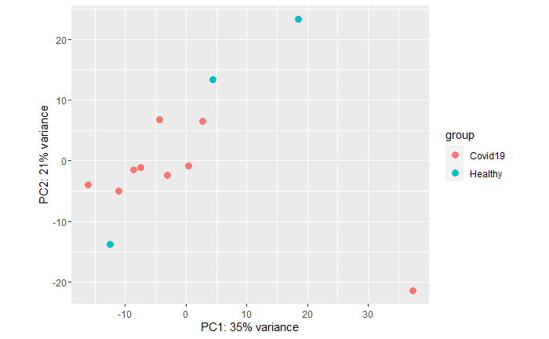

Differential gene expression studies has become one of the biggest areas of research since the creation of microarrays. This technique allows us to describe many pathways by observing the effects of gene disruptions on other genes. Analysis of COVID-19 infection reads compared to those of reads from healthy cells can provide insight into how the virus works and how we can effectivley combat it. We will discuss the analysis of gene expression from  SRA project  [PRJNA679264](https://www.ncbi.nlm.nih.gov/bioproject/PRJNA679264) consisting of 9 late onset COVID-19 reads and 4 healthy female reads.

For this module, you will need to install these R packages if you already haven't, either from Tools or from the Bioconductor website:

```{r setup, include=TRUE, warning=FALSE, message=FALSE}
knitr::opts_chunk$set(echo = TRUE)
library(knitr)
library(tidyverse)
library(ggthemes)
library(tidybulk)
library(ggsci)
library(DESeq2)
library(GenomeInfoDb)
library(GenomicRanges)
library(rtracklayer)
library(xlsx)
library(openxlsx)
library(ggplot2)
library(gprofiler2)
library(enrichR)
library(apeglm)
```

Inside a linux shell running conda you will also need to install STAR and subread
```{bash, echo=TRUE, eval=FALSE}
# install STAR
conda install -c bioconda star subread
```

## Sequence Aligning, and Feature Counting  

Under most conditions it would be necessary to use fastQC and Trimmomatic to prepare data, however QC had already been completed on these samples. To begin we use STAR aligner to map our reads to the human reference genome, but first we must download the reference with: 
```{bash, echo=TRUE, eval=FALSE}
# install STAR
conda install -c bioconda star

# get the hg38 reference genome files in your general work environment
mkdir hg38_genome
cd hg38_genome
wget https://hgdownload.soe.ucsc.edu/goldenPath/hg38/bigZips/genes/hg38.ncbiRefSeq.gtf.gz

# copy the files you want into the STAR source directory into a new directory called genomeDir
mkdir genomeDir
cp /hg38_genome/hg38.ncbiRefSeq.gtf.gz genomeDir 
```

Then creating the script star.sh, the reads were aligned to the reference using STAR
```{bash, echo=TRUE, eval=FALSE}
#!/bin/bash
#SBATCH --partition=bigmem
#SBATCH --nodes=1
#SBATCH --ntasks=4
#SBATCH --mem=50G
#SBATCH --time=20:00:00
#SBATCH --job-name=STAR_test
# %x=job-name %j=jobid
#SBATCH --output=%x_%j.out
#SBATCH --mail-user=jwcollie@uvm.edu
#SBATCH --mail-type=ALL


echo "Starting sbatch script star.sh at:`date`"
echo "  running host:    ${SLURMD_NODENAME}"
echo "  assigned nodes:  ${SLURM_JOB_NODELIST}"
echo "  jobid:           ${SLURM_JOBID}"

export LC_ALL=en_US.utf-8
export LANG=en_US.utf-8
cd genomeDir/

for i in *-Seq_1.fastq.gz
do
SAMPLE=$(echo ${i} | sed "s/-Seq_1\.fastq.gz//")
echo ${SAMPLE}-Seq_1.fastq.gz ${SAMPLE}-Seq_2.fastq.gz

STAR  \
--genomeDir /gpfs1/cl/mmg232/MMG232/RNAseq/human_gencode_GRCh38/ \
--runMode alignReads \
--genomeLoad  LoadAndKeep \
--runThreadN 6 \
--readFilesIn ${SAMPLE}-Seq_1.fastq.gz ${SAMPLE}-Seq_2.fastq.gz \
--readFilesCommand zcat \
--outFileNamePrefix ${SAMPLE}_star_out \
--outSAMtype BAM SortedByCoordinate \
--outSAMunmapped Within \
--outSAMattributes Standard \
--limitBAMsortRAM 31000000000

done

```

After STAR completes it produces 13 BAM files, one without data from a healthy female thus it is ommited from the rest of analysis. We are then able to run a feature count using: 

```{bash, echo=TRUE, eval=FALSE}
featureCounts -p -a /gpfs1/cl/mmg232/MMG232/RNAseq/human_gencode_GRCh38/gencode.v29.annotation.gtf -T 4 -o rawCounts 
SRR13081363_GSM4913651_whole_blood_DU09-02S0000156_Homo_sapiens_RNA_star_outAligned.sortedByCoord.out.bam
SRR13081345_GSM4913635_whole_blood_DU09-02S0000115_Homo_sapiens_RNA_star_outAligned.sortedByCoord.out.bam
SRR13081341_GSM4913632_whole_blood_DU09-02S0000114_Homo_sapiens_RNA_star_outAligned.sortedByCoord.out.bam
SRR13081270_GSM4913561_whole_blood_DU18-02S0011664_Homo_sapiens_RNA_star_outAligned.sortedByCoord.out.bam
SRR13081267_GSM4913558_whole_blood_DU18-02S0011667_Homo_sapiens_RNA_star_outAligned.sortedByCoord.out.bam
SRR13081262_GSM4913553_whole_blood_DU18-02S0011650_Homo_sapiens_RNA_star_outAligned.sortedByCoord.out.bam
SRR13081254_GSM4913545_whole_blood_DU18-02S0011645_Homo_sapiens_RNA_star_outAligned.sortedByCoord.out.bam
SRR13081238_GSM4913529_whole_blood_DU18-02S0011674_Homo_sapiens_RNA_star_outAligned.sortedByCoord.out.bam
SRR13081237_GSM4913528_whole_blood_DU18-02S0011673_Homo_sapiens_RNA_star_outAligned.sortedByCoord.out.bam
SRR13081234_GSM4913525_whole_blood_DU18-02S0011657_Homo_sapiens_RNA_star_outAligned.sortedByCoord.out.bam
SRR13081230_GSM4913521_whole_blood_DU18-02S0011658_Homo_sapiens_RNA_star_outAligned.sortedByCoord.out.bam
SRR13081219_GSM4913510_whole_blood_DU18-02S0011616_Homo_sapiens_RNA_star_outAligned.sortedByCoord.out.bam

#removes unneeded row 
cat rawCounts | sed 1d > rawCounts_female_without_first_line
```

## Differential Expression Analysis
We can now move in to R first reading in our female raw counts file. We will not run a differential expression analysis using DESeq2. Normalization of data is an extremely complex and intesive task, as said normalization must occur on many level. Using the code below the differential gene expression matrix was created 
```{r, echo=TRUE, eval=FALSE}
#read in alignment and convert to csv
featureCountsFile <- "/Users/frisk/Documents/School/AdvancedBioinformatics/RNA/rawCounts_females_without_first_line"
counts <- read.csv(featureCountsFile, sep="\t", header=TRUE)
rownames(counts) <- counts$Geneid

#check out the first two rows of counts to make sure it looks right
counts[1:2,]

# convert to a matrix and define a sample Information object with sample groups and number of replicates in each
counts <- as.matrix(counts[,7:ncol(counts)])
sampleInformation <- data.frame(samples=colnames(counts), condition= c(rep("Healthy", 3),rep("Covid19", 9) ))

rownames(sampleInformation) <- colnames(counts)

# run DESeq with those files
(coldata <- data.frame(row.names=colnames(counts), sampleInformation))
dds <- DESeqDataSetFromMatrix(countData = counts,
                              colData = sampleInformation,
                              design = ~ condition)
# filter low count genes; this step is highly variable!
keep <- rowSums(counts(dds)) >= 30
dds <- dds[keep,]
dds <- DESeq(dds)

# summarize the results and convert to a data frame
dds_expStat <- results(dds)
DEGmatrix <- as.data.frame(dds_expStat)
DEGmatrix$GeneID <- rownames(DEGmatrix)

#add additional annotation
geneAnnotation <- rtracklayer::import("/Users/frisk/Documents/School/AdvancedBioinformatics/RNA/gencode.v29.annotation.gtf")
geneAnnotation <- geneAnnotation %>% as.data.frame
geneAnnotation <- geneAnnotation[,c("seqnames","start","end","width","strand","type","gene_name","gene_id")]

#merge additional annotation object geneAnnotation with DEGmatrix
annotatedCounts <- merge(x=DEGmatrix,y=geneAnnotation,by.x="GeneID",by.y="gene_id",all=FALSE)
colnames(annotatedCounts) <- c("GeneID", "baseMean", "log2FoldChange", "lfcSE", "stat", "pvalue", "padj", "Chr","Start", "End", "Length", "Strand", "Type", "GeneName")

#Check dim() of each; they are not the same because GeneID can go to multiple parts/types of the same gene; filter to type = gene
DEG_genes <- annotatedCounts[annotatedCounts$Type == "gene",]

write.xlsx(DEG_genes,file="DEG_genes.xlsx",row.names = FALSE)

```
## PCA Analysis
We can now generate a PCA using the DESeq dataset created in the last step, first stabilizing the variance in data then plotting
```{r, echo=TRUE, eval=FALSE}
varianceStabilizingData <- vst(dds, blind=FALSE)
pca<-plotPCA(varianceStabilizingData)
pca
```


## Gprofiler2 Pathway Analysis
Using the differential expression matrix xlsx created earlier, a pathway enrichment analysis was run using gprofiler 2 via the code below:
```{r, echo=TRUE, eval=FALSE}
covidPathways <- read.xlsx("DEG_genes.xlsx", colNames=TRUE, rowNames=TRUE)
covidPathways <- tibble::rownames_to_column(covidPathways,"ENSid")

# Applying a significance filter to DEG_genes of FDR<=0.05 and 2x FC against the background of all of the sequenced genes
DEG_sig.degs <- covidPathways %>% filter(padj <= 0.05 & abs(log2FoldChange) >= 1)
DEG.bkground <- covidPathways %>% dplyr::select(c("GeneName"))

# Naming organism and calling particular databases
covidPathways.gostres.bg <- gost(query = DEG_sig.degs$GeneName, organism = "hsapiens",
                                 sources = c("GO:BP", "GO:MF", "GO:CC", "KEGG", "REAC", "WP"),
                                 significant = FALSE, correction_method ="g_SCS",
                                 custom_bg = DEG.bkground$GeneName, domain_scope="custom")

# Putting some of the more popular resources into an xlxs, but there are other options
write.xlsx(covidPathways.gostres.bg$result %>% select(c("term_id", "term_name","source","p_value", "query_size", "intersection_size")), file="covidPathways.gprofiler2.xlsx")
```

## EnrichR Gene Enrichment Analysis
In addition to gprofiler an enrichment analysis was also run using enrichR
```{r, echo=TRUE, eval=FALSE}
#view and pick from a list of databases
dbs <- listEnrichrDbs()
if (is.null(dbs)) websiteLive <- FALSE
if (websiteLive) head(dbs)

# define your gene set of interest from you DGE analysis
covidPathways <- read.xlsx("DEG_genes.xlsx", colNames=TRUE, rowNames=TRUE)
covidPathways <- tibble::rownames_to_column(covidPathways,"ENSid")
DEG_sig.degs <- covidPathways %>% filter(padj <= 0.05 & abs(log2FoldChange) >= 1)

# query enrichR
dbs <- c("GO_Molecular_Function_2015", "GO_Cellular_Component_2015", "GO_Biological_Process_2015")
if (websiteLive) {
  enriched <- enrichr(DEG_sig.degs$GeneName, dbs)
}

# view one of the databases in a table and plot the output
enrichR_BPTable <- if (websiteLive) enriched[["GO_Biological_Process_2015"]]

enrichR_BPPLot <- if (websiteLive) plotEnrich(enriched[[3]], showTerms = 20, numChar = 40, y = "Count", orderBy = "P.value")

#write the data.frame enrichR_BPTable to xlsx and print the BPPlot
write.xlsx(enrichR_BPTable, file="enrichR_BPTable.xlsx")
enrichR_BPPLot
```

## Supplemental Analysis
Below are assessments of genes passing an added p-value filter and adjustment of fold change filtering up and down. We see 127 genes passing the fold change filter increase to 2 and 273 genes when the filter is decreased to 0. The code below renders tables of the top 5 genes under each filtering scenario. The top upregulated genes are: RNU6-742P, EXOC3L4, HIST1H3I, ST18, and AC104791.2. The top downregulated genes are: AC005829.2, FAM3B, IL34, TUBB8P7, and RDM1P3. 
```{r, echo=TRUE, eval=FALSE}
DEG_sig.degsUp <- covidPathways %>% filter(padj <= 0.05 & abs(log2FoldChange) >= 2 & pvalue < 0.2)
highFoldUpregulated <- DEG_sig.degsUp[order(as.integer(DEG_sig.degsUp$log2FoldChange), decreasing = TRUE), ]
highFoldDownregulated <- DEG_sig.degsUp[order(as.integer(DEG_sig.degsUp$log2FoldChange), decreasing = FALSE), ]
kable(highFoldUpregulated[1:5, ], caption = " Upregulated Genes passing filtered pvalue and increased foldchange")
kable(highFoldDownregulated[1:5, ], caption = " Downregulated Genes passing filtered pvalue and increased foldchange")
```

```{r, echo=TRUE, eval=FALSE}
DEG_sig.degsDown <- covidPathways %>% filter(padj <= 0.05 & abs(log2FoldChange) >= 0 & pvalue < 0.2)
lowFoldUpregulated <- DEG_sig.degsDown[order(as.integer(DEG_sig.degsDown$log2FoldChange), decreasing = TRUE), ]
lowFoldDownregulated <- DEG_sig.degsDown[order(as.integer(DEG_sig.degsDown$log2FoldChange), decreasing = FALSE), ]
kable(lowFoldUpregulated[1:5, ], caption = " Upregulated Genes passing filtered pvalue and decreased foldchange")
kable(lowFoldDownregulated[1:5, ], caption = " Downregulated Genes passing filtered pvalue and decreased foldchange")
```

```{r, echo=TRUE, eval=FALSE}
resLFC <- lfcShrink(dds, coef="condition_Healthy_vs_Covid19", type="apeglm")
plotMA(resLFC, ylim=c(-2,2))
```


## Top Gprofiler and EnrichR terms 

After review of the gprofiler output GO:0006614 (SRP-dependent cotranslational protein targeting to membrane ) was seen to have the most enrichment with a p-value of 5.80843E-14.

The top 6 EnrichR terms were cotranslational protein targeting to membrane (GO:0006613), viral transcription (GO:0019083), protein targeting to ER (GO:0045047), establishment of protein localization to endoplasmic reticulum (GO:0072599), translational termination (GO:0006415), and protein localization to endoplasmic reticulum (GO:0070972)

Both analyses show heavy enrichment of pathways involved in translation and protein export of cell with high upregulation of protein transport proteins such as protein transport protein Sec61 subunit alpha-like, SEC63 homolog, protein translocation regulator, and Protein transport protein Sec61 subunit beta, which is not surprising given the samples in question are virally infected.

```